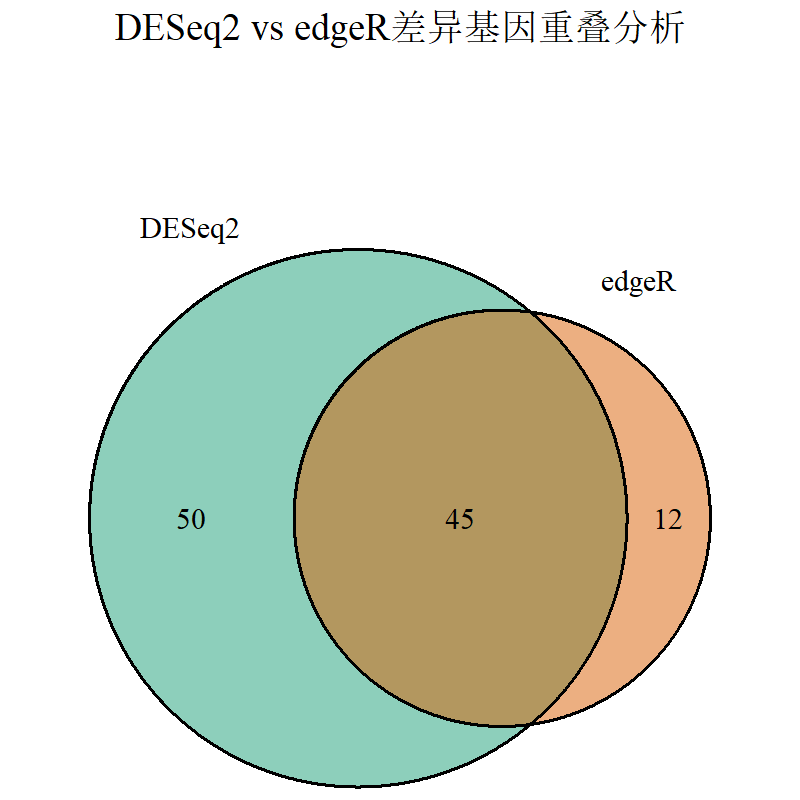

# Part III. 2.1 RNA-seq - Expression Matrix
## 1)
### CPM/RPM(每百万 reads 数)
CPM=某基因reads数/百万总reads数

仅校正测序深度，忽略基因长度。适用于基因长度相似的情况。
### RPKM(每千碱基每百万 reads 数)
RPKM=某基因reads数/(百万总reads数×某基因kb长度)

单端测序，同时校正测序深度和基因长度。适用于样本内基因间比较。
### FPKM(每千碱基每百万 reads 数)
FPKM=RPKM/2
 
双端测序，同时校正测序深度和基因长度。适用于样本内基因间比较。
### TPM（每百万转录本数）
TPM=RPKM*10^6/总RPKM

同时校正测序深度、基因长度和转录组组成差异。适用于样本间的比较。
### TMM（Trimmed Mean of M-values/M值的截尾均值)(edgeR)
M值：对数比值

M=log2(样本A中某基因的表达量/样本B（参考样本）中某基因的表达量)

​​A值:(表达水平均值)

A=​​log2(样本A中某基因的表达量×样本B中某基因的表达量)/2

之后去除极端值，计算加权平均的缩放因子，再进行校正。

假设大部分基因非差异表达。对差异基因稳健性较高。适合样本间差异表达分析。
### RLE(相对对数表达)(DESeq2)
对基因 g，计算其在所有样本中表达量的几何均值

对于样本 i 中的基因 g，计算其表达量与几何均值的比值

对样本 i，取所有基因比值的中位数作为缩放因子

对样本 i，计算每个基因 g 表达量与缩放因子的比值作为归一化的表达量

假设大部分基因表达比例稳定。对差异基因的稳健性较低。适合多个样本的差异表达分析。
## 2)
### E
### D
### A
## 3)
```
root@featurecount_docker:/home/test# /usr/local/bin/infer_experiment.py -r GTF/Arabidopsis_thaliana.TAIR10.34.bed -i bam/Shape02.bam
Reading reference gene model GTF/Arabidopsis_thaliana.TAIR10.34.bed ... Done
Loading SAM/BAM file ...  Total 200000 usable reads were sampled


This is PairEnd Data
Fraction of reads failed to determine: 0.0315
Fraction of reads explained by "1++,1--,2+-,2-+": 0.4769
Fraction of reads explained by "1+-,1-+,2++,2--": 0.4916
```
两类比例接近，说明是Strand Non-specific的次序协议。
```
root@featurecount_docker:/home/test# /home/software/subread-2.0.3-source/bin/featureCounts \-s 0 -p -t exon -g gene_id \-a GTF/Arabidopsis_thaliana.TAIR10.34.gtf \-o result/Shape02.featurecounts.exon.txt bam/Shape02.bam

root@featurecount_docker:/home/test/result# grep "AT1G09530" Shape02.featurecounts.exon.txt
AT1G09530       1;1;1;1;1;1;1;1;1;1;1;1;1;1;1;1;1;1;1;1;1;1;1;1;1;1;1;1;1;1;1;1;1;1;1;1;1;1;1;1;1;1;1   3075768;3075768;3075768;3076401;3076401;3076401;3076459;3076459;3076459;3077173;3077173;3077173;3077173;3077378;3077378;3077378;3077378;3077378;3077378;3078346;3078346;3078346;3078346;3078346;3078346;3078545;3078545;3078545;3078545;3078545;3078545;3078843;3078843;3078843;3078843;3078843;3078843;3078984;3078984;3078984;3078984;3078984;3078984 3075852;3075852;3075852;3077286;3076808;3076748;3076808;3077286;3076748;3077286;3077286;3077286;3077286;3078257;3078257;3078257;3078257;3078257;3078257;3078453;3078453;3078453;3078453;3078453;3078453;3078610;3078610;3078610;3078610;3078610;3078610;3078908;3078908;3078908;3078908;3078908;3078908;3079544;3079544;3079544;3079654;3079654;3079654 +;+;+;+;+;+;+;+;+;+;+;+;+;+;+;+;+;+;+;+;+;+;+;+;+;+;+;+;+;+;+;+;+;+;+;+;+;+;+;+;+;+;+   2762    86
```
有86个counts
## 4)
```
# 1.获取文件目录
file_list <- list.files(path = "tumor-transcriptome-demo",
                        pattern = "\\.txt$",
                        recursive = TRUE,
                        full.names = TRUE)

# 检查是否找到文件（重要！）
if(length(file_list) == 0) stop("未找到任何.txt文件，请检查路径")

count_list <- list()
group <- character()
gene_ids <- NULL

for (i in seq_along(file_list)) {
  file <- file_list[i]
  data <- read.delim(file, skip = 2, header = TRUE)
  
  # 明确指定count列位置（原代码假设最后一列可能有误）
  counts <- data[, 7]  # featureCounts输出第7列为counts
  
  # 初始化基因名
  if(is.null(gene_ids)) {
    gene_ids <- data$Geneid
  } else {
    if(!identical(data$Geneid, gene_ids)) {
      stop(paste(file, "中的基因ID不匹配"))
    }
  }
  
  count_list[[i]] <- counts
  # 更稳健的分组信息提取方法
  group[i] <- strsplit(dirname(file), "/")[[1]][2] # 假设路径结构为 主目录/癌症类型/文件
}

# 转换为矩阵并添加名称（修复维度错误的核心步骤）
count_matrix <- matrix(unlist(count_list), 
                       ncol = length(count_list),
                       dimnames = list(gene_ids, 
                                       sub("\\.txt$", "", basename(file_list))))
# 2. 数据预处理
y <- DGEList(counts = count_matrix, group = group)
keep <- filterByExpr(y)
y <- y[keep, , keep.lib.sizes = FALSE]
y <- calcNormFactors(y)
# 3. 计算logCPM和Z-score
logcpm <- cpm(y, log = TRUE)
z_scores <- t(scale(t(logcpm)))
# 4. 绘制热图
annotation_col <- data.frame(CancerType = factor(group))
rownames(annotation_col) <- colnames(z_scores)

pheatmap(z_scores,
         cluster_cols = TRUE,
         show_rownames = FALSE,
         show_colnames = FALSE,
         annotation_col = annotation_col,
         color = colorRampPalette(c("blue", "white", "red"))(50),
         main = "Z-score of logCPM Expression")
```

如图未能加载出来，可见压缩包附件(Rplot05.png)。

其中COAD和READ的转录组是最接近的。
# Differential Expression with DEseq2 and edgeR
## 1)
Multiple Test Correction（多重检验校正）是用于控制因同时进行大量统计检验而导致的假阳性增加的方法。

p值表示在​​单次检验​​中，在原假设（H₀）成立时，观察到当前数据或更极端结果的概率。用于衡量单次检验的显著性。但在多次检验中，若未校正，假阳性率会显著上升。

q值是​​错误发现率（False Discovery Rate, FDR）​​ 的估计值，表示在"显著"结果中，假阳性所占比例的期望值。用于在​​多重检验​​中控制错误发现的比例，平衡假阳性和检测能力。

## 2）
### DESeq2的标准化方法：RLE(Relative log expression
​​
DESeq2假设大多数基因在样本间无差异表达，通过计算每个样本的尺寸因子（Size Factor）校正测序深度差异。

#### ​​1.计算每个基因的几何均值​​:

对基因i在所有样本中的原始计数k_ij 

取几何均值：

g_i=(∏_j k_ij)^(1/n)

注：仅计算在所有样本中表达量非零的基因。

#### ​​2.计算每个样本的比值中位数​​
对样本j中的每个基因i，计算其原始计数与几何均值的比值：

r_ij=k_ij/g_i
​
取所有基因比值的中位数作为样本j的尺寸因子s_j

s_j==median({r_ij})

#### 3.标准化后的表达量​​

原始计数k_ij除以尺寸因子s_j

Normalized-Count_ij= k_ij/s_j

#### 该方法的生物学意义​​：

​​几何均值​​：消除样本间测序深度的差异，假设大部分基因无差异表达。

​​比值中位数​​：估计样本间系统性偏差（如文库大小差异），避免高表达基因主导标准化过程。
### edgeR的标准化方法：Trimmed Mean of M-values (TMM)​
TMM通过选择参考样本，修剪极端值后计算缩放因子（Scaling Factor），校正文库大小和RNA组成差异。

#### 1.​​选择参考样本​​

通常选择样本中位数或总计数中位数对应的样本作为参考（记为样本r）。

#### 2.计算M值和A值​​
对每个基因i在样本j和参考样本r中的计数k_ij和k_ir
​
​​M值​​（对数倍数变化）：

M_ij=log_2(k_ij+ϵ)-log_2(k_ir+ϵ)

​​A值​​（平均表达水平）：

A_ij=(log_2(k_ij+ϵ)+log_2(k_ir+ϵ))/2

注：ϵ为伪计数（通常取0.5），避免零计数问题。

#### 3.​​修剪极端值​​

根据A值范围去除表达量过高（如前5%）或过低（如后5%）的基因。

对剩余基因的M值进行对称修剪（如去除30%极端值）。

#### 4.计算加权平均M值​​
对修剪后的M值计算加权平均，权重为基因表达的倒数方差：

W_ij=(k_ij+ϵ)(k_ir+ϵ)/(k_ij+k_ir+2ϵ)

TMM_j=(∑W_ij*M_ij)/(∑W_ij)

#### 5.计算缩放因子和有效文库大小​​
将TMM值转换为缩放因子：

SF_j=2^(TMM_j)

有效文库大小为原始文库大小乘以缩放因子：

ELS_j=N_j*SF_j

#### 6.使用有效文库大小计算每百万计数（CPM）：
CPM_ij=k_ij*10^6/ELS_j
#### 该方法的生物学意义​​：
​​M值和A值​​：识别样本间表达倍数变化和平均表达水平。

​​修剪极端值​​：排除差异表达基因对标准化的干扰。

​​加权平均​​：高表达基因赋予更高权重，提升稳健性。
## 3)
txt见压缩包其他文件。
```
#读取数据
raw.counts <- read.table("count_exon.txt", sep='\t', header = T,row.names = 1)
#我们这里只使用野生型数据进行分析
wt.raw.counts <- raw.counts[,c("UD1_1", "UD1_2", "UD1_3", "UD0_1", "UD0_2", "UD0_3")]
#过滤掉表达量过低的基因
wt.filtered.counts <- wt.raw.counts[rowMeans(wt.raw.counts) > 5, ]
# "CD1_1", "CD1_2", "CD1_3" 三个样本为control
# "CD0_1", "CD0_2", "CD0_3 三个样本对应treatment
conditions <- factor(c(rep("Control", 3), rep("Treatment", 3)),levels = c("Control","Treatment"))
colData <- data.frame(row.names = colnames(wt.filtered.counts),conditions=conditions)
library(DESeq2)
# 我们到这里才开始使用DESeq2 package
# library(DESeq2)会输出一长串的提示信息，如果不需要可使用suppressPackageStartupMessages(library(DESeq2))

dds <- DESeqDataSetFromMatrix(wt.filtered.counts, colData, design = ~conditions)
#进行差异分析
dds <- DESeq(dds)
#获取结果
res <- results(dds)
# 如果你想保存所有结果，也可以不过滤
write.table(res,"urv8.light.vs.dark.all.txt", sep='\t', row.names = T, quote = F)
# 你也可以筛选出有差异的基因
# 过滤标准: padj < 0.05, log2 fold change > 1
diff.table <- subset(res, padj < 0.05 & abs(log2FoldChange) > 1)
# 将结果保存至"wt.light.vs.dark.txt
write.table(diff.table,"urv8.light.vs.dark.txt", sep='\t', row.names = T, quote = F)
```
```
#读取数据
raw.counts <- read.table("count_exon.txt", sep='\t', header = T,row.names = 1)
#我们这里只使用野生型数据进行分析
wt.raw.counts <- raw.counts[,c("UD1_1", "UD1_2", "UD1_3", "UD0_1", "UD0_2", "UD0_3")]
#过滤掉表达量过低的基因
wt.filtered.counts <- wt.raw.counts[rowMeans(wt.raw.counts) > 5, ]
conditions <- factor(c(rep("Control", 3), rep("Treatment", 3)),levels = c("Control","Treatment"))
#获取design矩阵
design <- model.matrix(~conditions)
library(edgeR) # 至此我们开始用到edgeR package
y <- DGEList(counts = wt.filtered.counts) # 定义edgeR用于存储基因表达信息的DGEList对象

# TMM标准化 (TMM 实际上是edgeR的默认参数)
y <- calcNormFactors(y, method="TMM")

# 估计dispersion
y <- estimateDisp(y,design = design)
# edgeR内部进行了以下三步调用，有兴趣的同学可以查阅文档，看一看它们分别在做什么事情
# y <- estimateGLMCommonDisp(y,design = design)
# y <- estimateGLMTrendedDisp(y,design = design)
# y <- estimateGLMTagwiseDisp(y,design = design)

# 拟合广义线性模型
fit <- glmFit(y, design = design)

# 似然比检验
# coef = 2指的是对design矩阵的第二列（即是否照光）对应的系数进行检验
lrt <- glmLRT(fit,coef=2) 
# 这里tag就是基因的意思，topTags意思是返回变化最top的基因
# 默认返回10个基因，按p值排序
# 这里我们用n = nrow(y)要求它返回所有基因的结果
diff.table <- topTags(lrt, n = nrow(y))$table

# 保存差异分析结果
write.table(diff.table, file = 'edgeR.uvr8.light.vs.dark.all.txt', sep = "\t", quote = F, row.names = T, col.names = T)

# 当然你也可以只挑选显著变化的基因
diff.table.filtered <- diff.table[abs(diff.table$logFC) > 1 & diff.table$FDR < 0.05,]
write.table(diff.table.filtered, file = 'edgeR.uvr8.light.vs.dark.txt', sep = "\t", quote = F, row.names = T, col.names = T)
```
## 4)

如图未加载出来，可见压缩包其他文件(DESeq2_edgeR_Venn.png)。
```
# 安装必要的包（如果未安装）
if (!require("VennDiagram")) install.packages("VennDiagram")
library(VennDiagram)

# 读取DESeq2和edgeR结果文件 -------------------------------------------------
deseq2_res <- read.delim("DESeq2_uvr8_light_vs_dark.txt", row.names = 1)
edger_res <- read.delim("edgeR_uvr8_light_vs_dark.txt", row.names = 1)

# 定义差异基因筛选阈值
padj_threshold <- 0.05
logFC_threshold <- 1  # log2FoldChange对应DESeq2，logFC对应edgeR

# 提取差异基因列表 ---------------------------------------------------------
# DESeq2差异基因（padj < 0.05且|log2FC| ≥ 1）
deseq2_sig <- rownames(deseq2_res)[
  deseq2_res$padj < padj_threshold & 
    abs(deseq2_res$log2FoldChange) >= logFC_threshold &
    !is.na(deseq2_res$padj)
]

# edgeR差异基因（FDR < 0.05且|logFC| ≥ 1）
edger_sig <- rownames(edger_res)[
  edger_res$FDR < padj_threshold & 
    abs(edger_res$logFC) >= logFC_threshold &
    !is.na(edger_res$FDR)
]

# 统计重叠情况 ------------------------------------------------------------
overlap_genes <- intersect(deseq2_sig, edger_sig)
only_deseq2 <- setdiff(deseq2_sig, edger_sig)
only_edger <- setdiff(edger_sig, deseq2_sig)

cat("DESeq2差异基因总数:", length(deseq2_sig), "\n")
cat("edgeR差异基因总数:", length(edger_sig), "\n")
cat("共同差异基因数:", length(overlap_genes), "\n")
cat("仅DESeq2特有基因:", length(only_deseq2), "\n")
cat("仅edgeR特有基因:", length(only_edger), "\n")

# 绘制Venn图 -------------------------------------------------------------
venn.plot <- venn.diagram(
  x = list(DESeq2 = deseq2_sig, edgeR = edger_sig),
  filename = NULL,  # 不直接保存文件
  fill = c("#1b9e77", "#d95f02"),  # 颜色设置
  alpha = 0.5,
  cex = 1.2,
  cat.cex = 1.2,
  cat.pos = c(-30, 30),
  cat.dist = 0.05,
  margin = 0.1,
  main = "DESeq2 vs edgeR差异基因重叠分析",
  main.cex = 1.5
)

# 显示并保存图片
grid.draw(venn.plot)

# 保存为PDF（矢量图）
pdf("DESeq2_edgeR_Venn.pdf", width = 6, height = 6)
grid.draw(venn.plot)
dev.off()

# 保存为PNG（位图）
png("DESeq2_edgeR_Venn.png", width = 800, height = 800, res = 150)
grid.draw(venn.plot)
dev.off()
```
## 5)

如图未加载出来，可见压缩包其他文件(heatmap2.3.png)。
```
# 加载所需包
library(edgeR)
library(pheatmap)

# 读取原始表达矩阵 -----------------------------------------------------------
count_data <- read.delim("count_exon.txt", row.names = "gene_id", check.names = FALSE)

# 提取uvr8突变型样本（UD1=光照前，UD0=光照后）
uvr8_counts <- count_data[, c("UD1_1", "UD1_2", "UD1_3", "UD0_1", "UD0_2", "UD0_3")]

# 读取edgeR结果 ------------------------------------------------------------
edger_res <- read.delim("edgeR_uvr8_light_vs_dark.txt", row.names = 1)

# 筛选FDR<0.05的基因 ------------------------------------------------------
sig_genes <- rownames(edger_res)[edger_res$FDR < 0.05 & !is.na(edger_res$FDR)]

# 按logFC排序并取top10/最小10 ---------------------------------------------
edger_sig <- edger_res[sig_genes, ]
edger_sig <- edger_sig[order(-edger_sig$logFC), ]  # 按logFC降序排列

top_genes <- head(edger_sig, 10)         # logFC最大的10个基因
bottom_genes <- tail(edger_sig, 10)      # logFC最小的10个基因
selected_genes <- rbind(top_genes, bottom_genes)

# 计算log10CPM ------------------------------------------------------------
# 使用edgeR计算CPM（counts per million）
cpm_matrix <- cpm(uvr8_counts, log = FALSE)  # 先计算原始CPM
log10cpm_matrix <- log10(cpm_matrix + 1)     # log10(CPM+1)转换

# 提取目标基因的表达矩阵
target_matrix <- log10cpm_matrix[rownames(selected_genes), ]

# Z-score标准化（按基因/行方向）-------------------------------------------
zscore_matrix <- t(scale(t(target_matrix)))  # 行标准化

# 准备样本注释信息 --------------------------------------------------------
sample_info <- data.frame(
  Condition = factor(
    c(rep("pre", 3), rep("post", 3)),
    levels = c("pre", "post")
  ),
  row.names = colnames(uvr8_counts)
)

# 绘制热图 ----------------------------------------------------------------
pheatmap(
  mat = zscore_matrix,
  color = colorRampPalette(c("blue", "white", "red"))(50),
  border_color = NA,
  cluster_rows = FALSE,                # 不聚类行（保持排序）
  cluster_cols = FALSE,                # 不聚类列（保持组别顺序）
  show_rownames = TRUE,
  show_colnames = TRUE,
  annotation_col = sample_info,
  main = "Top/Bottom 10 DE Genes (logFC)\nZ-score of log10(CPM+1)",
  fontsize_row = 8,
  fontsize_col = 10,
  gaps_col = 3                          # 在pre/post组之间添加分隔线
)
```


​
 

