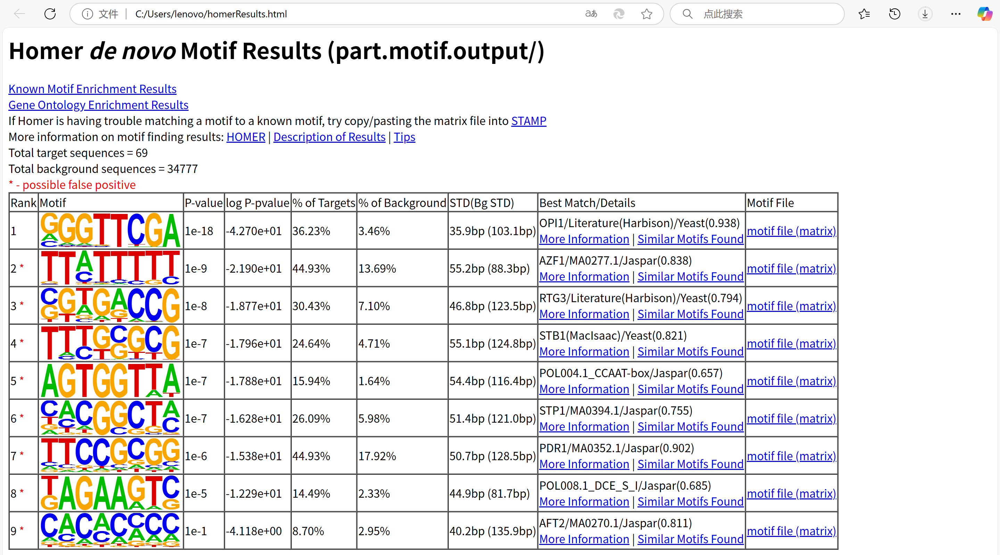

# 1.
超声破碎DNA的效率、PCR扩增偏好性、测序仪器的偏向性（如GC含量偏好）等因素可能导致某些基因组区域的测序信号偏高，
同时抗体可能结合非目标蛋白或非特异性DNA区域，
且开放染色质区域可能因可及性高而更容易被超声破碎或测序覆盖。
通过进行input组的对照，可以校正这些偏差，减少技术噪音和假阳性的影响。
# 2.
## findPeaks
​​<input file>​​ 输入文件（通常是处理后的BAM/SAM文件） 
​​-style <type>​​ 指定分析类型 
​​-o <output>​​ 输出文件名  
​​-i <input control>​​ Input对照文件（背景信号）  
​​-region​​ 仅分析特定基因组区域（如启动子） 
​​-size <bp>​​ 峰区扩展长度（默认200bp） 
​​-F <FDR阈值>​​ 假发现率阈值（默认0.001）  
​​-effectiveGenomeSize <size>​​ 有效基因组大小（排除重复区域）  
​​-minDist <bp>​​ 相邻峰之间的最小距离（默认自动计算）  
​​-L <fold>​​ 输入对照信号放大倍数（默认1）
## findMotifsGenome.pl
<peak file>​​ 输入峰文件（findPeaks的输出） 
​​<genome>​​ 参考基因组版本 
​​<output directory>​​ 输出目录 
​​-size <bp>​​ 分析序列长度（默认200bp） 
​​-mask​​ 屏蔽重复序列 
​​-bg <background>​​ 背景序列选择 
​​-len <motif长度>​​ 搜索的motif长度（默认8,10,12）  
​​-p <threads>​​ 并行计算线程数  
​​-norevopp​​ 仅分析正链序列  
​​-nomotif​​ 跳过motif搜索（仅富集分析）  
​​-h​​ 输出帮助信息 
# 3.
peaks
```
# HOMER Peaks
# Peak finding parameters:
# tag directory = ip/
#
# total peaks = 69
# peak size = 248
# peaks found using tags on both strands
# minimum distance between peaks = 496
# fragment length = 232
# genome size = 2097191
# Total tags = 1402413.0
# Total tags in peaks = 135829.0
# Approximate IP efficiency = 9.69%
# tags per bp = 0.668669
# expected tags per peak = 165.830
# maximum tags considered per bp = 66.0
# effective number of tags used for normalization = 10000000.0
# Peaks have been centered at maximum tag pile-up
# FDR rate threshold = 0.001000000
# FDR effective poisson threshold = 1.876888e-05
# FDR tag threshold = 222.0
# number of putative peaks = 402
#
# input tag directory = input/
# Fold over input required = 4.00
# Poisson p-value over input required = 1.00e-04
# Putative peaks filtered by input = 323
#
# size of region used for local filtering = 10000
# Fold over local region required = 4.00
# Poisson p-value over local region required = 1.00e-04
# Putative peaks filtered by local signal = 10
#
# Maximum fold under expected unique positions for tags = 2.00
# Putative peaks filtered for being too clonal = 0
#
# cmd = findPeaks ip/ -style factor -o part.peak -i input/
#
# Column Headers:
#PeakID	chr	start	end	strand	Normalized Tag Count	focus ratio	findPeaks Score	Total Tags	Control Tags (normalized to IP Experiment)	Fold Change vs Control	p-value vs Control	Fold Change vs Local	p-value vs Local	Clonal Fold Change
chrIV-1	chrIV	465220	465468	+	111129.9	0.920	15510.000000	15585.0	234.1	66.57	0.00e+00	55.11	0.00e+00	0.50
chrIV-2	chrIV	1490100	1490348	+	81687.8	0.857	11468.000000	11456.0	195.1	58.72	0.00e+00	35.06	0.00e+00	0.50
chrV-1	chrV	141138	141386	+	54449.0	0.855	7647.000000	7636.0	182.3	41.88	0.00e+00	21.55	0.00e+00	0.52
chrV-2	chrV	69078	69326	+	48659.0	0.823	6837.000000	6824.0	206.5	33.05	0.00e+00	20.52	0.00e+00	0.50
chrV-3	chrV	85195	85443	+	46277.4	0.861	6493.000000	6490.0	225.6	28.77	0.00e+00	21.56	0.00e+00	0.50
chrIV-3	chrIV	1080509	1080757	+	34405.0	0.832	4830.000000	4825.0	234.1	20.61	0.00e+00	23.11	0.00e+00	0.50
chrIV-4	chrIV	599953	600201	+	26597.0	0.755	3733.000000	3730.0	190.1	19.62	0.00e+00	15.58	0.00e+00	0.50
chrV-4	chrV	321939	322187	+	24821.5	0.754	3484.000000	3481.0	177.4	19.63	0.00e+00	13.66	0.00e+00	0.50
chrIV-5	chrIV	1468786	1469034	+	23595.0	0.794	3317.000000	3309.0	193.7	17.08	0.00e+00	14.36	0.00e+00	0.51
chrIV-6	chrIV	132817	133065	+	19402.3	0.782	2723.000000	2721.0	209.3	13.00	0.00e+00	11.95	0.00e+00	0.52
chrIV-7	chrIV	591669	591917	+	18304.2	0.792	2568.000000	2567.0	200.1	12.83	0.00e+00	12.88	0.00e+00	0.50
chrIV-8	chrIV	721812	722060	+	17840.7	0.739	2514.000000	2502.0	192.3	13.01	0.00e+00	9.61	0.00e+00	0.51
chrIV-9	chrIV	1	230	+	17206.1	0.884	2444.000000	2430.0	60.3	40.30	0.00e+00	632.81	0.00e+00	0.81
chrIV-10	chrIV	1233763	1234011	+	16250.6	0.888	2303.000000	2279.0	156.1	14.60	0.00e+00	10.68	0.00e+00	0.52
chrIV-11	chrIV	234340	234588	+	16179.3	0.790	2275.000000	2269.0	199.4	11.38	0.00e+00	9.37	0.00e+00	0.51
chrV-5	chrV	225453	225701	+	15066.9	0.901	2123.000000	2113.0	157.5	13.42	0.00e+00	11.73	0.00e+00	0.53
chrIV-12	chrIV	357166	357414	+	15052.6	0.705	2113.000000	2111.0	205.7	10.26	0.00e+00	8.19	0.00e+00	0.51
chrIV-13	chrIV	416932	417180	+	13954.5	0.838	1973.000000	1957.0	188.0	10.41	0.00e+00	10.83	0.00e+00	0.51
chrIV-15	chrIV	1278678	1278926	+	13697.8	0.852	1925.000000	1921.0	225.6	8.51	0.00e+00	12.86	0.00e+00	0.52
chrIV-16	chrIV	1164971	1165219	+	13419.7	0.746	1887.000000	1882.0	215.7	8.73	0.00e+00	9.29	0.00e+00	0.52
chrV-6	chrV	491091	491339	+	12457.1	0.773	1749.000000	1747.0	180.9	9.66	0.00e+00	13.69	0.00e+00	0.52
chrIV-14	chrIV	1525285	1525496	+	11779.7	0.923	1953.000000	1652.0	58.2	28.40	0.00e+00	32.51	0.00e+00	1.27
chrIV-17	chrIV	722439	722687	+	10774.3	0.676	1512.000000	1511.0	172.4	8.76	0.00e+00	5.26	0.00e+00	0.53
chrIV-46	chrIV	568825	569073	+	5005.7	0.820	705.000000	702.0	85.8	8.18	0.00e+00	4.54	3.86e-226	0.84
```

