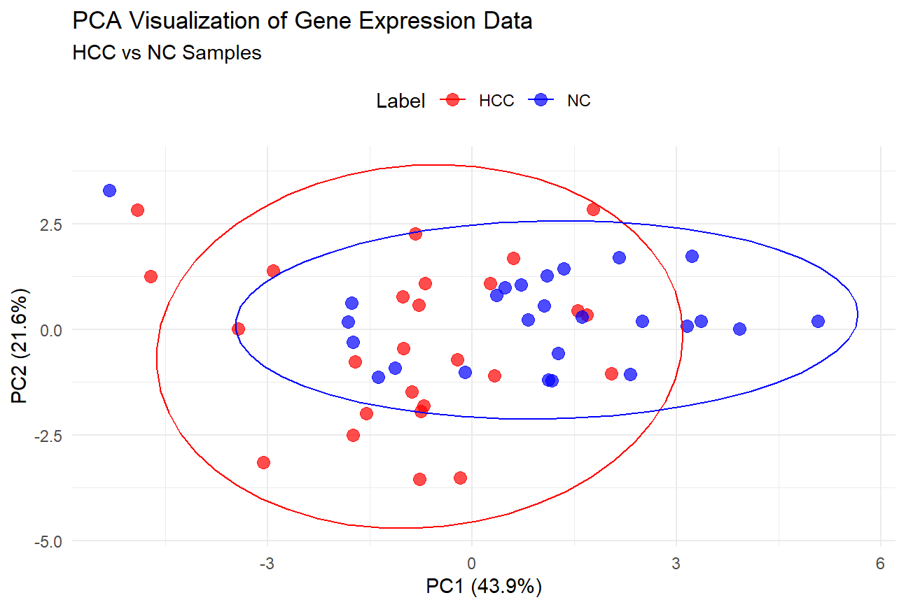
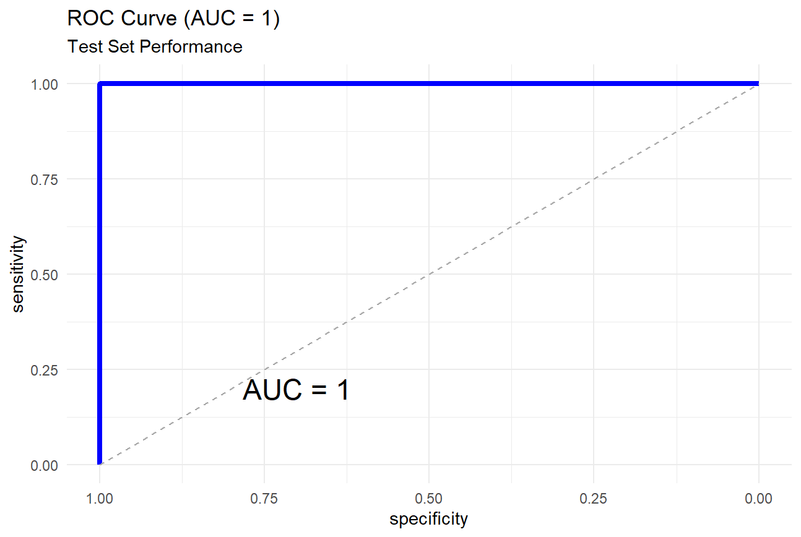

## PCA结果，如本地不显示可见压缩包，或访问网页

## ROC曲线，如本地不显示可见压缩包，或访问网页

## 代码部分
```
library(tidyverse)
library(glmnet)
library(caret)
library(pROC)

# 1. 数据读取与预处理
data <- read.csv("qPCR_data.csv", stringsAsFactors = TRUE)

# 检查数据结构
str(data)

# 重命名标签列为"Label"（确保列名一致）
colnames(data)[ncol(data)] <- "Label"

# 用中位数补全空缺值
data_imputed <- data %>%
  mutate(across(where(is.numeric), ~ifelse(is.na(.), median(., na.rm = TRUE), .)))

# 2. 数据标准化 (scaling)
# 只对特征列进行标准化
preProc <- preProcess(data_imputed[, 2:(ncol(data_imputed)-1)], method = c("center", "scale"))
data_scaled <- data_imputed
data_scaled[, 2:(ncol(data_scaled)-1)] <- predict(preProc, data_imputed[, 2:(ncol(data_imputed)-1)])

# 3. 数据可视化 - PCA
pca_result <- prcomp(data_scaled[, 2:(ncol(data_scaled)-1)], center = TRUE, scale. = TRUE)
pca_data <- data.frame(pca_result$x, Label = data_scaled$Label)

# 绘制PCA图
ggplot(pca_data, aes(x = PC1, y = PC2, color = Label)) +
  geom_point(alpha = 0.7, size = 3) +
  stat_ellipse(level = 0.95) +  # 添加95%置信椭圆
  labs(title = "PCA Visualization of Gene Expression Data",
       subtitle = "HCC vs NC Samples",
       x = paste0("PC1 (", round(100 * summary(pca_result)$importance[2,1], 1), "%)"),
       y = paste0("PC2 (", round(100 * summary(pca_result)$importance[2,2], 1), "%)")) +
  scale_color_manual(values = c("HCC" = "red", "NC" = "blue")) +
  theme_minimal() +
  theme(legend.position = "top")

# 4. 数据集划分
set.seed(666)
trainIndex <- createDataPartition(data_scaled$Label, p = 0.8, list = FALSE)
trainData <- data_scaled[trainIndex, ]
testData <- data_scaled[-trainIndex, ]

# 准备矩阵格式 (glmnet要求)
x_train <- as.matrix(trainData[, 2:(ncol(trainData)-1)])
y_train <- as.factor(trainData$Label)
x_test <- as.matrix(testData[, 2:(ncol(testData)-1)])
y_test <- as.factor(testData$Label)

# 5. 模型训练与特征选择
# 使用弹性网络正则化进行特征选择和分类
ctrl <- trainControl(
  method = "repeatedcv",
  number = 10,
  repeats = 3,
  classProbs = TRUE,
  summaryFunction = twoClassSummary,
  selectionFunction = "best"
)

# 设置参数网格
glmnetGrid <- expand.grid(
  alpha = seq(0, 1, length = 11),  # 混合参数：0=岭回归，1=lasso
  lambda = 10^seq(-4, 0, length = 50)  # 正则化强度
)

# 训练模型
set.seed(666)
model <- train(
  x = x_train,
  y = y_train,
  method = "glmnet",
  family = "binomial",
  trControl = ctrl,
  tuneGrid = glmnetGrid,
  metric = "ROC"
)

# 查看最佳参数
print(paste("Best alpha:", model$bestTune$alpha))
print(paste("Best lambda:", round(model$bestTune$lambda, 5)))

# 6. 模型评估
# 在测试集上预测概率
testPred <- predict(model, newdata = x_test, type = "prob")

# 计算AUROC
rocObj <- roc(response = y_test, predictor = testPred$HCC, levels = c("NC", "HCC"))
auc_value <- auc(rocObj)

# 绘制ROC曲线
ggroc(rocObj, color = "blue", size = 1.5) +
  geom_segment(aes(x = 1, y = 0, xend = 0, yend = 1), color = "darkgray", linetype = "dashed") +
  labs(title = paste0("ROC Curve (AUC = ", round(auc_value, 3), ")"),
       subtitle = "Test Set Performance") +
  annotate("text", x = 0.7, y = 0.2, 
           label = paste0("AUC = ", round(auc_value, 3)), size = 6) +
  theme_minimal()
```
